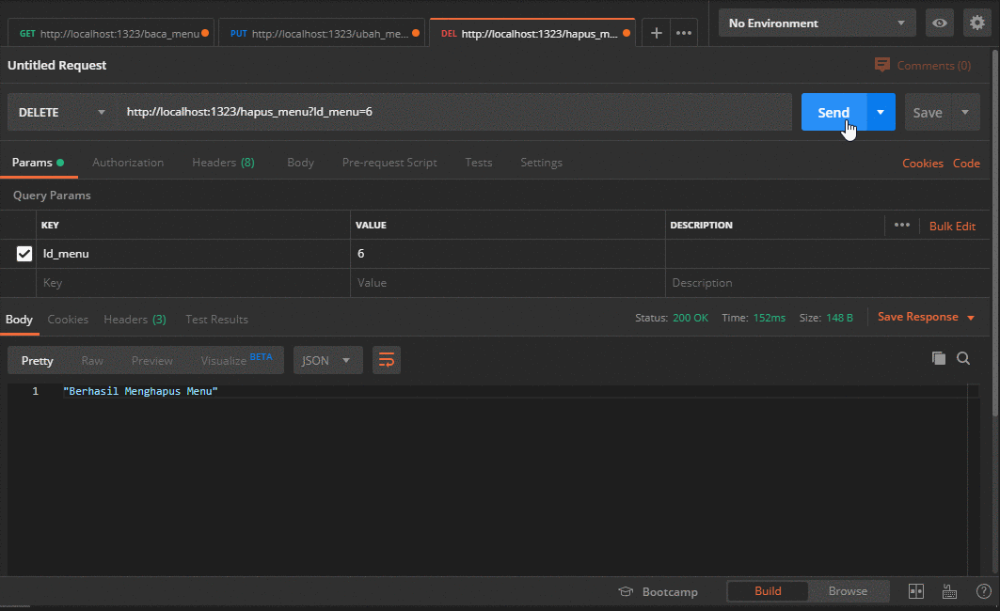

# Golang - Food Web dengan Framework Echo

> Website Food menggunakan framework `echo` yang terintegrasi dengan database `mysql`

### Package yang digunakan:

1. labstack
2. mattn
3. valyala
4. crypto
5. sys
6. [https://github.com/go-sql-driver/mysql](https://github.com/go-sql-driver/mysql) - Go MySQL Driver

### Installasi:

- Download atau Clone Repository.
- Extract kedalam folder baru berinama 'echo'  →  C:/Go/src/<echo>
- Jalankan:

        go run main.go

### API Routes Screenshoot:

